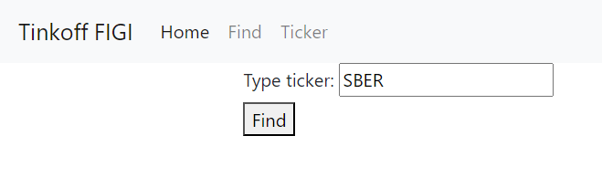
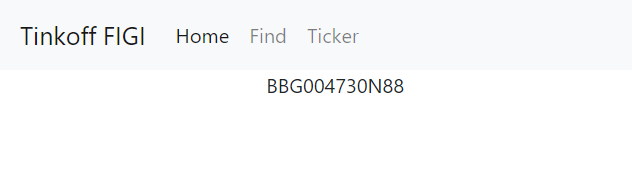

# Tinkoff FIGI lookup

Приложение по работе с [Tinkoff API](https://github.com/Tinkoff/invest-python).
Токен задается через переменную окружения **tinkoff_sandbox_token**.






### FastAPI
Run server
```bash
cd rest
uvicorn main:app --port 8001 --reload
```
http://127.0.0.1:8001/ticker/SBER
http://127.0.0.1:8001/candles/USD000UTSTOM
http://127.0.0.1:8001/operations

### Django
Create Django project
```bash
django-admin startproject mysite
cd mysite
python manage.py startapp myapp
```

Run server
```bash
python manage.py runserver
```
http://127.0.0.1:8000

Migrations
```bash
python manage.py makemigrations
python manage.py migrate
```

Run admin
```bash
python manage.py createsuperuser
```
http://127.0.0.1:8000/admin
